# Dating Apps: DevOps, Testing & ML Infrastructure

## Overview
This document covers CI/CD practices, deployment strategies, testing methodologies, A/B testing frameworks, quality assurance, and machine learning infrastructure for major dating apps.

---

## CI/CD & Deployment Practices

### Tinder's Jenkins CI/CD Pipeline

```mermaid
graph LR
    subgraph "Code Commit"
        COMMIT[Developer Commit]
        PR[Pull Request]
        REVIEW[Code Review]
    end

    subgraph "CI Pipeline (Jenkins)"
        BUILD[Build<br/>Android/iOS]
        UNIT[Unit Tests<br/>Automated]
        INTEGRATION[Integration Tests<br/>API Tests]
        SECURITY[Security Scan<br/>SAST/DAST]
    end

    subgraph "Deployment"
        STAGING[Staging Environment<br/>Pre-production]
        CANARY[Canary Deploy<br/>5% Traffic]
        ROLLOUT[Gradual Rollout<br/>25% → 50% → 100%]
        PROD[Production<br/>Full Traffic]
    end

    subgraph "Monitoring"
        METRICS[Metrics<br/>DataDog/CloudWatch]
        ALERTS[Alerts<br/>PagerDuty]
        ROLLBACK[Auto-Rollback<br/>If Error Rate Spikes]
    end

    COMMIT --> PR
    PR --> REVIEW
    REVIEW --> BUILD

    BUILD --> UNIT
    UNIT --> INTEGRATION
    INTEGRATION --> SECURITY

    SECURITY -->|Pass| STAGING
    SECURITY -->|Fail| ROLLBACK

    STAGING --> CANARY
    CANARY --> ROLLOUT
    ROLLOUT --> PROD

    PROD --> METRICS
    METRICS --> ALERTS
    ALERTS --> ROLLBACK

    style SECURITY fill:#90EE90
    style ROLLBACK fill:#ff6b6b
```

### Deployment Frequency

| Metric | Tinder | Industry Average | High Performers |
|--------|--------|------------------|-----------------|
| **Deployment Frequency** | Multiple per day | Weekly | Multiple per day |
| **Lead Time** | <1 hour | 1 week | <1 hour |
| **Change Failure Rate** | <5% | 15-20% | <5% |
| **Time to Restore** | <1 hour | 1 day | <1 hour |

### Kubernetes Deployment Strategy

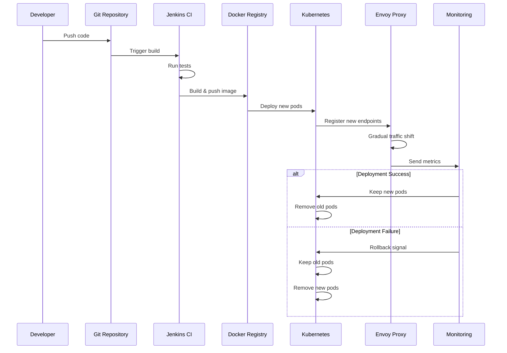

---

## Testing Strategies

### Tinder's Evolution in Testing

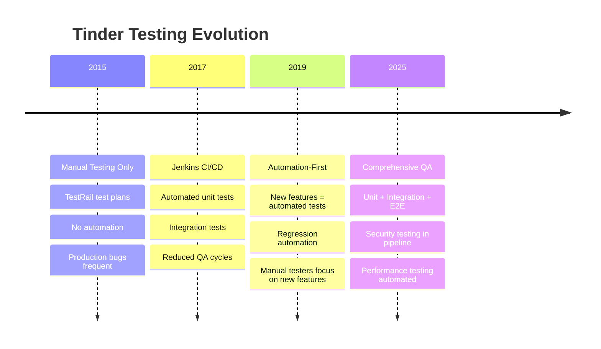

### Test Pyramid

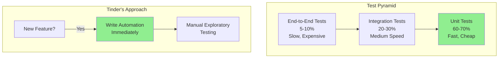

### Testing Coverage

| Test Type | Coverage Target | Tinder (Estimated) | Industry Best Practice |
|-----------|----------------|--------------------|-----------------------|
| **Unit Tests** | 70-80% | 75% | 80%+ |
| **Integration Tests** | 50-60% | 60% | 60%+ |
| **E2E Tests** | Critical Paths | 90%+ | 100% of critical |
| **Security Tests** | 100% | 100% | 100% |
| **Performance Tests** | Key APIs | 100% | 100% |

---

## A/B Testing Framework

### Tinder's A/B Testing Philosophy

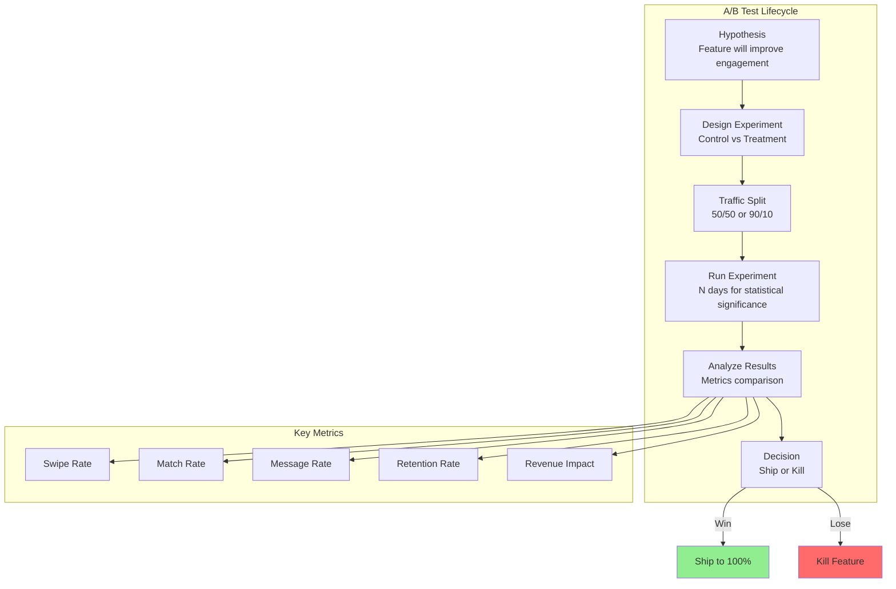

### Bumble's A/B Testing with UI Tests

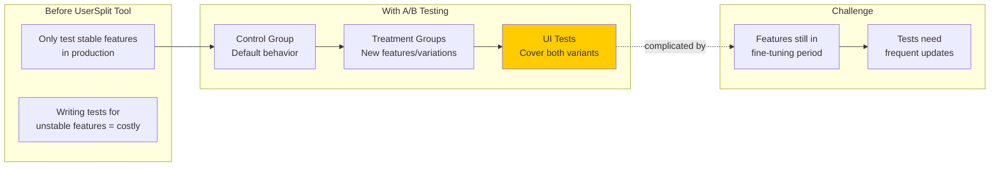

### A/B Testing Best Practices

1. **Statistical Significance**: Run tests until 95%+ confidence
2. **Sample Size**: Minimum 1000 users per variant
3. **Duration**: At least 1-2 weeks to account for day-of-week effects
4. **Metrics**: Track 5-10 key metrics (not just one)
5. **Control Group**: Always maintain a control group
6. **Segmentation**: Test across user segments (new vs returning, iOS vs Android)

---

## Quality Assurance Practices

### Dating App Testing Complexity

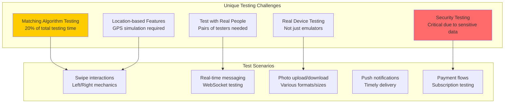

### Testing Recommendations

1. **Use Real Devices**: Emulators miss critical issues
2. **Test in Pairs**: Matching requires two real users
3. **Security Focus**: 25% of testing time on security
4. **Matching Algorithm**: Dedicated 20% time allocation
5. **Performance**: Test under load (10K+ concurrent users)
6. **Edge Cases**: Poor connectivity, low battery, background mode

---

## Machine Learning Infrastructure

### Tinder's ML Stack

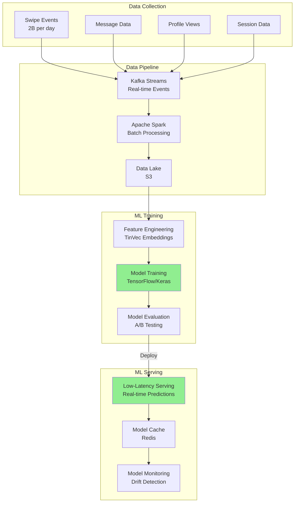

### TinVec: Tinder's Recommendation System

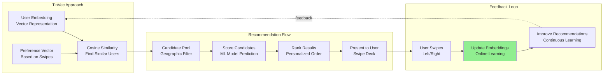

### Tinder's Smart Photos

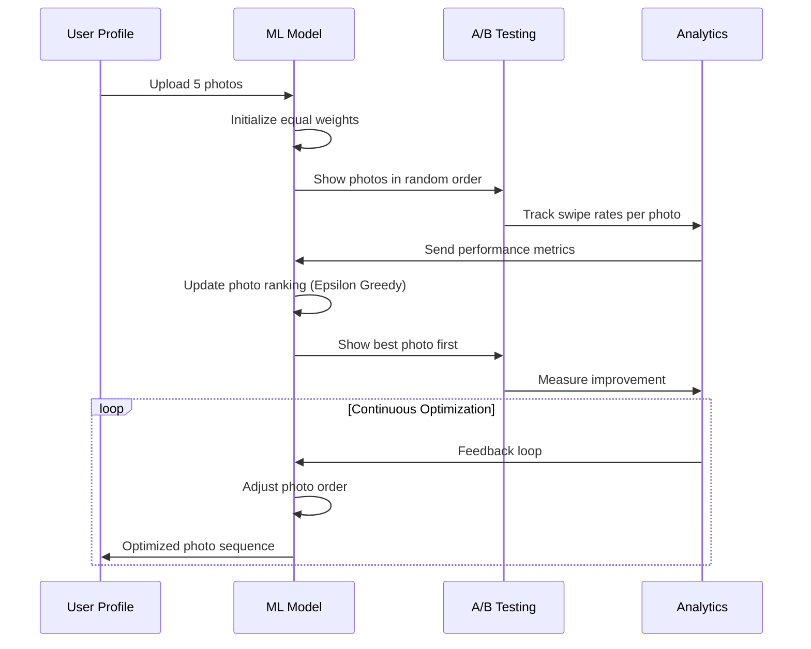

**Algorithm**: Epsilon Greedy
- **Exploration**: 10% of time, show random photo
- **Exploitation**: 90% of time, show best-performing photo
- **Result**: Maximizes match rate by optimizing photo order

### Hinge's Machine Learning

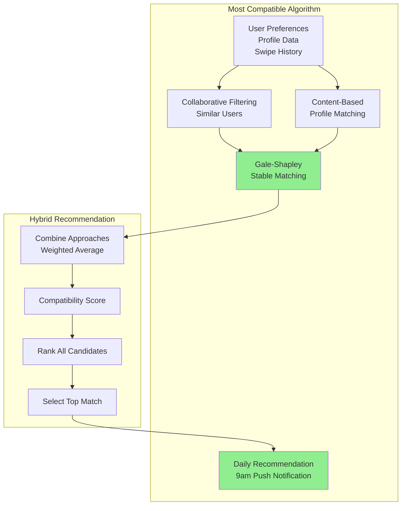

### Bumble's ML Approach

- **Collaborative Filtering**: Find users with similar preferences
- **Content-Based Filtering**: Match based on profile attributes
- **Hybrid System**: Combine both approaches
- **Safety ML**: AI for detecting inappropriate content, spam, fake profiles
- **Photo Verification**: ML-powered face matching for profile verification

---

## ML Infrastructure Components

### Tech Stack Comparison

| Component | Tinder | Hinge | Bumble | Industry Standard |
|-----------|--------|-------|--------|-------------------|
| **Framework** | TensorFlow, Keras | scikit-learn, PyTorch | TensorFlow | TensorFlow/PyTorch |
| **Data Processing** | Spark | Pandas, Spark | Spark | Spark/Flink |
| **Feature Store** | Custom (TinVec) | Custom | Custom | Feast/Tecton |
| **Model Serving** | Custom (low latency) | Django API | Custom | TorchServe/TFServing |
| **Monitoring** | Custom + DataDog | Unknown | Custom | Evidently AI/Arize |
| **Experimentation** | A/B Testing Platform | A/B Testing | UserSplit Tool | Optimizely/LaunchDarkly |

### ML Model Deployment Pipeline

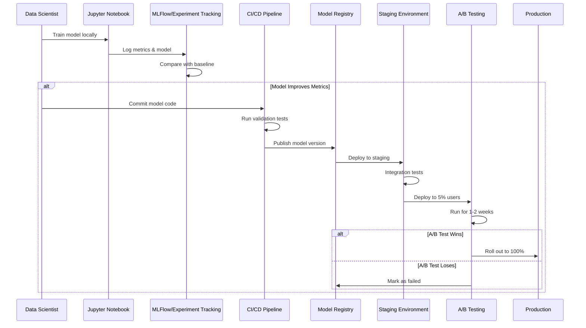

---

## Monitoring & Observability

### Observability Stack

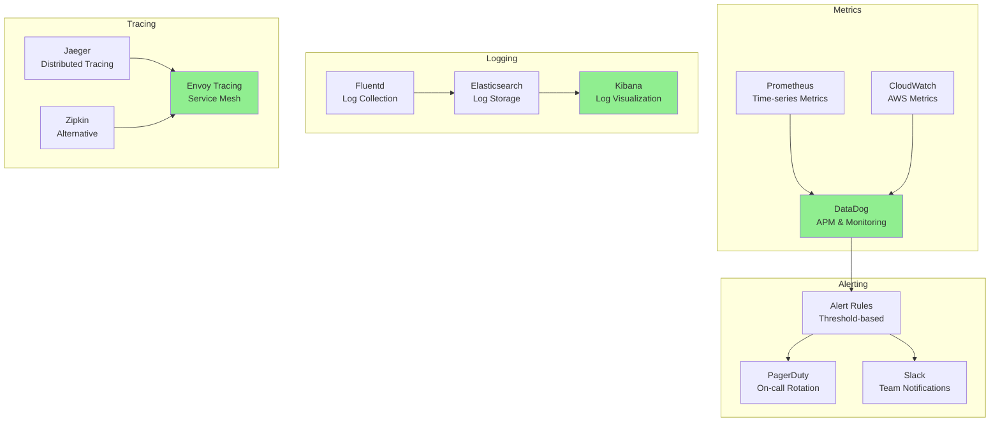

### Key Metrics to Monitor

#### Application Metrics
- Request rate (requests/sec)
- Error rate (%)
- Latency (p50, p95, p99)
- Saturation (CPU, memory, disk)

#### Business Metrics
- Swipe rate
- Match rate
- Message rate
- Conversion rate (free to paid)
- Churn rate

#### ML Model Metrics
- Model latency
- Prediction accuracy
- Feature drift
- Model drift
- A/B test performance

---

## DevOps Best Practices Comparison

### Tinder's Approach
✅ **Strengths**:
- Automation-first culture
- Multiple deployments per day
- Comprehensive monitoring
- Fast rollback capabilities

❌ **Challenges**:
- 500+ services = complex deployments
- Coordination overhead
- High operational burden

### Hinge's Approach
✅ **Strengths**:
- Simpler architecture = easier deployments
- Faster iteration speed
- Lower operational overhead

❌ **Challenges**:
- Django limitations at scale
- Manual testing still significant
- Less mature CI/CD (assumed)

---

## Cost of Quality

### Investment Breakdown

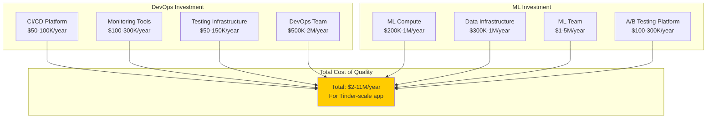

### ROI Analysis
- **Investment**: $2-11M/year in quality infrastructure
- **Prevented Costs**:
  - Production incidents: -$10M/year
  - Poor user experience: -$20M revenue
  - Slow feature velocity: -$30M opportunity cost
- **Net ROI**: ~5-10x return on investment

---

## Recommendations for New Dating Apps

### Minimum Viable DevOps Stack

```
Phase 1 (MVP - 0-100K users):
- CI/CD: GitHub Actions (free tier)
- Monitoring: DataDog (startup program) or Prometheus
- Logging: ELK Stack or CloudWatch
- Testing: Jest/Pytest for unit, Cypress for E2E
- Team: 1 DevOps engineer

Cost: $50-100K/year
```

```
Phase 2 (Growth - 100K-1M users):
- CI/CD: GitHub Actions + Jenkins
- Monitoring: DataDog + PagerDuty
- Testing: Full test pyramid + security scans
- A/B Testing: LaunchDarkly or Optimizely
- Team: 2-3 DevOps engineers

Cost: $200-400K/year
```

```
Phase 3 (Scale - 1M+ users):
- CI/CD: Jenkins + ArgoCD (Kubernetes)
- Monitoring: Full observability stack
- Testing: Automated at all levels
- ML Infrastructure: Model training/serving
- Team: 5-10 DevOps/SRE engineers

Cost: $1-3M/year
```

---

## Key Takeaways

1. **Automation is Critical**: Manual testing doesn't scale beyond early stage
2. **A/B Test Everything**: Data-driven decisions beat opinions
3. **ML is a Competitive Advantage**: Recommendation quality drives engagement
4. **Invest in Observability**: You can't fix what you can't see
5. **Quality Costs Less Than Failure**: $2-11M/year << cost of major outages

**Bottom Line**: Modern dating apps are ML-powered, data-driven platforms that require sophisticated DevOps practices to operate at scale. The investment in quality infrastructure pays for itself through better user experience, faster iteration, and fewer production incidents.
