# Dating Apps: Technical Evolution Timeline & Third-Party Integrations

## Overview
This document traces the technical evolution of major dating apps from inception to 2025, documenting major migrations, architectural changes, and third-party service integrations.

---

## Tinder: Complete Technical Evolution (2012-2025)

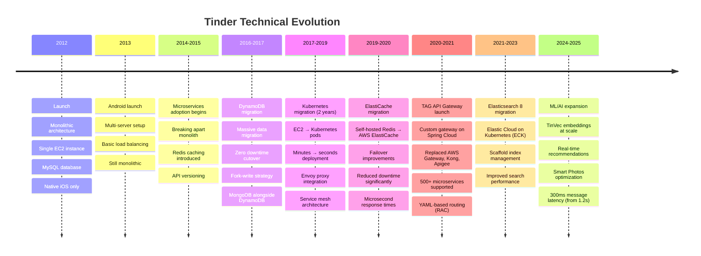

### Key Migration Details

#### 2017: DynamoDB Migration

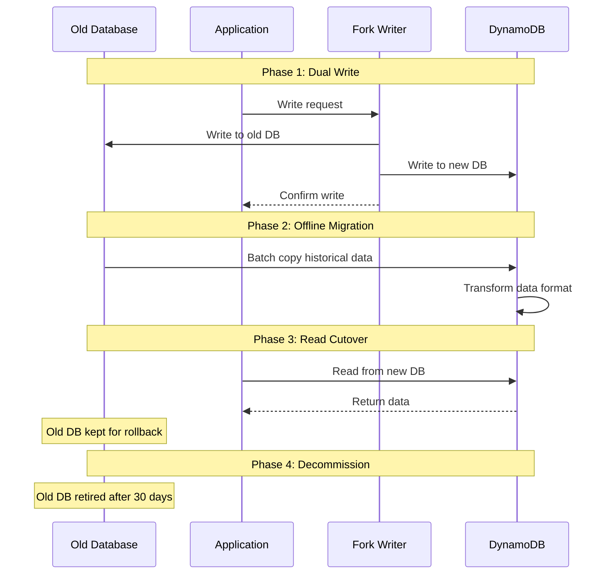

**Results**:
- Zero downtime migration
- Handled billions of records
- Gradual cutover reduced risk
- Completed in 6 months

#### 2017-2019: Kubernetes Migration

**Before**:
- EC2 instances: Minutes to provision
- Manual scaling
- Complex deployment orchestration
- Limited resource utilization

**After**:
- Kubernetes pods: Seconds to schedule
- Automatic scaling
- Declarative deployments
- 70%+ resource utilization

**Duration**: 2 years (phased approach)

**Key Decisions**:
- Chose Envoy as service proxy
- One Envoy sidecar per pod
- Front-proxy Envoy pods per AZ
- Gradual traffic shifting for safety

#### 2019-2020: ElastiCache Migration

**Problem**: Redis failover was #1 source of app downtime

**Solution**: Migrate to AWS ElastiCache
- **Strategy**: Fork writes to both clusters
- **Warming**: Wait for ElastiCache to fill from writes
- **Cutover**: Switch reads to ElastiCache
- **Results**: Immediate gains in stability and scalability

---

## OkCupid: 20-Year Technical Journey (2004-2025)

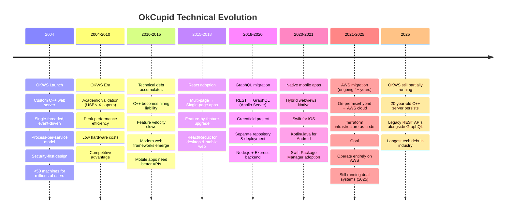

### OKWS: A Cautionary Tale

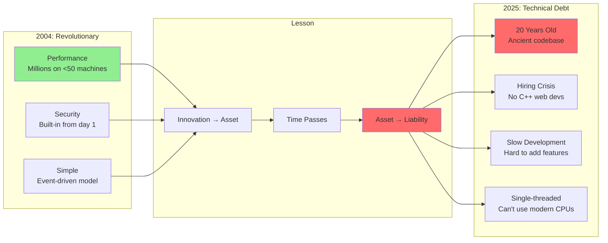

**Key Insight**: Building custom infrastructure gives short-term advantage but becomes long-term burden. OKWS was brilliant in 2004, catastrophic in 2025.

---

## Bumble: Transformation to Bumble 2.0 (2014-2025)

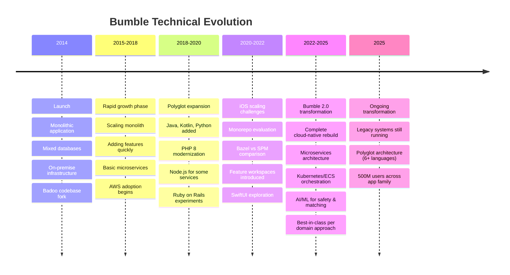

### Bumble 2.0: Modernization Challenge

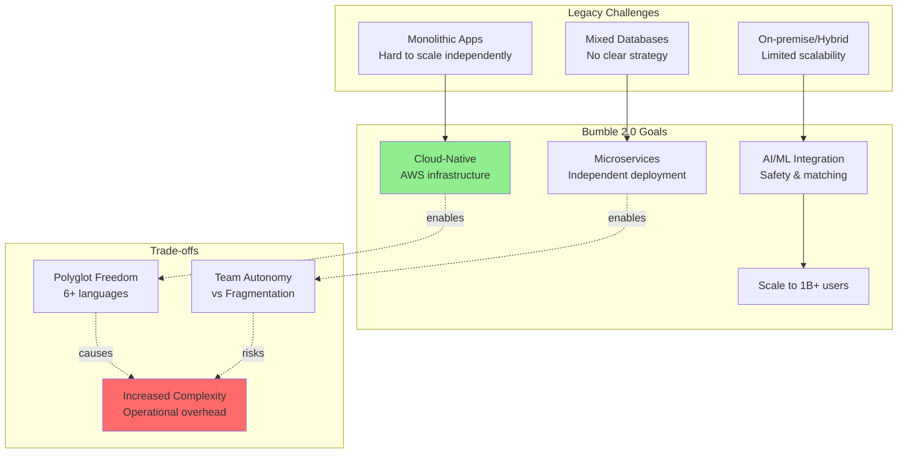

---

## Hinge: Pragmatic Evolution (2012-2025)

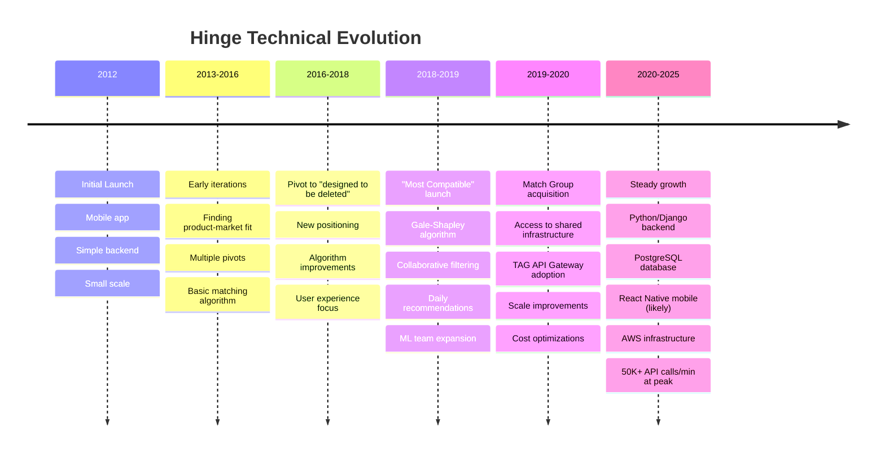

### Hinge's Smart Choices

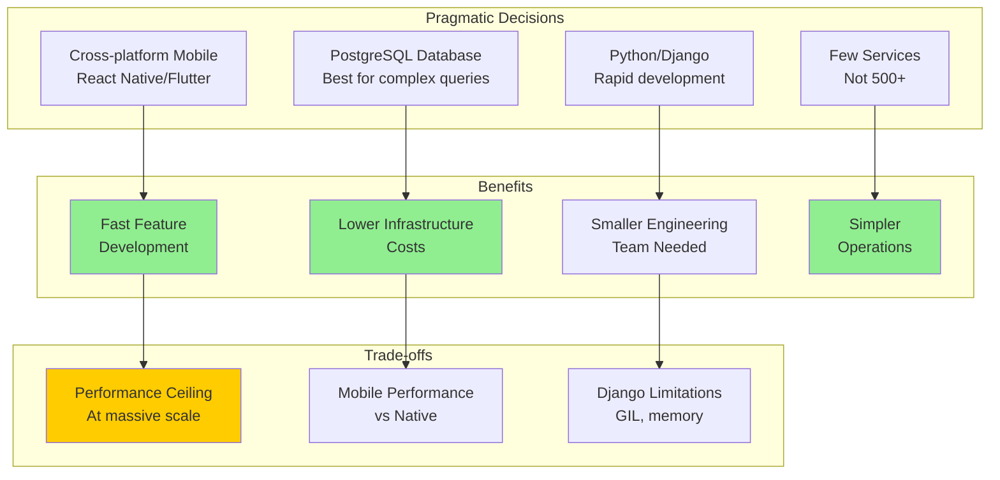

---

## Third-Party Service Integrations

### Common Integration Patterns

```mermaid
graph TB
    subgraph "Dating App Core"
        APP[Dating App Backend]
    end

    subgraph "Authentication & Identity"
        OAUTH[OAuth Providers<br/>Google, Facebook, Apple]
        PHONE[Phone Verification<br/>Twilio]
    end

    subgraph "Payments"
        STRIPE[Stripe<br/>Payment Processing]
        APPLE_PAY[Apple Pay<br/>iOS Payments]
        GOOGLE_PAY[Google Pay<br/>Android Payments]
    end

    subgraph "Messaging & Notifications"
        SMS[Twilio<br/>SMS Notifications]
        EMAIL[SendGrid<br/>Email Service]
        PUSH_IOS[APNs<br/>iOS Push]
        PUSH_AND[FCM<br/>Android Push]
    end

    subgraph "Media & Storage"
        S3[AWS S3<br/>Photo Storage]
        CLOUDFRONT[CloudFront<br/>CDN]
        IMGIX[Imgix<br/>Image Optimization]
    end

    subgraph "Analytics & Monitoring"
        ANALYTICS[Amplitude/Mixpanel<br/>Product Analytics]
        MPARTICLE[mParticle<br/>Data Collection]
        DATADOG[DataDog<br/>Monitoring]
    end

    APP --> OAUTH
    APP --> PHONE
    APP --> STRIPE
    APP --> APPLE_PAY
    APP --> GOOGLE_PAY
    APP --> SMS
    APP --> EMAIL
    APP --> PUSH_IOS
    APP --> PUSH_AND
    APP --> S3
    APP --> CLOUDFRONT
    APP --> IMGIX
    APP --> ANALYTICS
    APP --> MPARTICLE
    APP --> DATADOG

    style APP fill:#90EE90
```

### Service Integration Costs (Estimated Monthly)

| Category | Service | Cost (10K users) | Cost (1M users) | Cost (10M users) |
|----------|---------|------------------|-----------------|------------------|
| **Payments** | Stripe | 2.9% + $0.30/txn | 2.7% + $0.30/txn | 2.5% + $0.30/txn |
| **SMS** | Twilio | $500 | $5,000 | $50,000 |
| **Email** | SendGrid | $100 | $500 | $5,000 |
| **Push** | FCM/APNs | Free | Free | Free |
| **Auth** | Auth0 | $240 | $2,400 | Custom |
| **Storage** | S3 | $500 | $5,000 | $50,000 |
| **CDN** | CloudFront | $200 | $2,000 | $20,000 |
| **Analytics** | Amplitude | $500 | $5,000 | Custom |
| **Monitoring** | DataDog | $500 | $5,000 | $50,000 |
| **Total** | | **~$2,500/mo** | **~$25,000/mo** | **~$200,000/mo** |

### OkCupid's Third-Party Stack

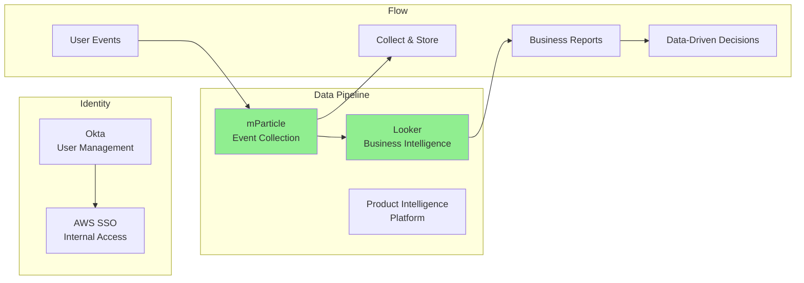

---

## Integration Best Practices

### When to Use Third-Party Services

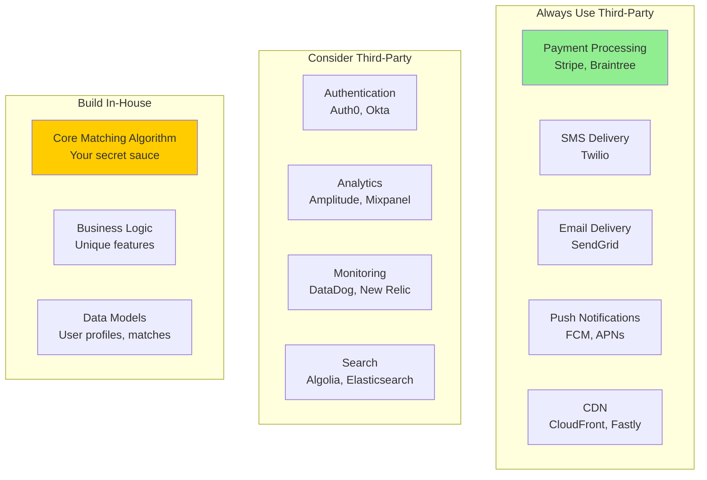

### Integration Cost-Benefit Analysis

**Third-Party Pros**:
- ✅ Faster time-to-market
- ✅ Lower development costs
- ✅ Proven reliability
- ✅ Automatic updates
- ✅ Compliance handled (e.g., PCI for payments)

**Third-Party Cons**:
- ❌ Monthly fees add up
- ❌ Vendor lock-in
- ❌ Limited customization
- ❌ Data sharing concerns
- ❌ Dependency on third-party uptime

**Rule of Thumb**: Use third-party for undifferentiated heavy lifting, build in-house for competitive differentiators.

---

## Migration Lessons Learned

### Tinder's Successful Migrations

1. **DynamoDB (2017)**: Zero-downtime migration using dual-write strategy
2. **Kubernetes (2017-2019)**: 2-year gradual rollout, Envoy integration
3. **ElastiCache (2019-2020)**: Solved #1 downtime source
4. **Elasticsearch 8 (2021-2025)**: Scaffold tooling, ECK platform

**Key Success Factors**:
- Gradual rollouts (canary → 25% → 50% → 100%)
- Fork-write strategies for dual systems
- Comprehensive monitoring and alerting
- Rollback plans for every phase
- Engineering investment (full-time migration teams)

### OkCupid's Struggling Migration

1. **OKWS → Modern Stack**: 10+ years and counting
2. **AWS Migration**: 4+ years (started 2021, ongoing 2025)
3. **GraphQL Migration**: Successful greenfield approach

**What Went Wrong**:
- Too gradual (decades-long transitions)
- Insufficient engineering resources
- Legacy debt too deep
- Dual systems for too long

**Lesson**: Rip the band-aid off. Set aggressive deadlines. Allocate 50%+ of team to migration.

### Bumble's Ongoing Transformation

**Bumble 2.0** has been underway for 3+ years (2022-2025+)

**Risks**:
- Polyglot fragmentation
- Team autonomy without guardrails
- Complexity explosion
- Incomplete migration

**Opportunity**: Perfect chance to rationalize tech stack during rebuild

---

## Timeline Comparison: Migration Speeds

| Migration | Company | Duration | Success? | Key Factor |
|-----------|---------|----------|----------|------------|
| DynamoDB | Tinder | 6 months | ✅ Yes | Aggressive timeline |
| Kubernetes | Tinder | 2 years | ✅ Yes | Gradual, well-planned |
| ElastiCache | Tinder | 6-12 months | ✅ Yes | Fork-write strategy |
| AWS | OkCupid | 4+ years (ongoing) | ❌ Slow | Insufficient resources |
| OKWS → Modern | OkCupid | 10+ years | ❌ No | Too gradual |
| Bumble 2.0 | Bumble | 3+ years (ongoing) | ⏳ TBD | Mid-migration |

**Pattern**: Successful migrations take 6 months to 2 years with dedicated teams. Unsuccessful migrations drag on 5-10+ years.

---

## Future Technical Evolution (2025-2030)

### Predicted Trends

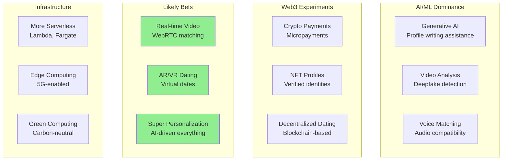

---

## Key Insights

### 1. **Migrations are Expensive and Risky**
- Tinder spent 2 years on Kubernetes migration
- OkCupid's AWS migration: 4+ years and counting
- Must allocate 50%+ of engineering to migration

### 2. **Custom Infrastructure Becomes Technical Debt**
- OKWS was innovative in 2004, catastrophic by 2025
- 20 years of technical debt is almost impossible to pay off
- Build vs buy: Buy wins for infrastructure

### 3. **Gradual Can Be Too Slow**
- OkCupid's decade-long migrations hurt competitiveness
- Dual systems for years = double operational cost
- Better: Aggressive 6-12 month migrations with full team

### 4. **Third-Party Services are Cost-Effective**
- $200K/month for 10M users is cheap vs building in-house
- Faster time-to-market is worth the cost
- Use third-party for everything except core differentiators

### 5. **Polyglot Architectures are Risky**
- Bumble's 6+ languages creates operational chaos
- Team autonomy without guardrails = fragmentation
- Better: 2-3 languages maximum

---

## Recommendations

### For Migration Success
1. **Set aggressive timelines** (6-12 months, not 5 years)
2. **Allocate 50%+ of engineering** to migration work
3. **Use fork-write patterns** for dual systems
4. **Gradual rollouts** with comprehensive monitoring
5. **Have rollback plans** for every phase

### For Third-Party Integration
1. **Always use third-party for**:
   - Payments (Stripe)
   - SMS (Twilio)
   - Email (SendGrid)
   - Push notifications (FCM/APNs)

2. **Consider third-party for**:
   - Authentication (Auth0)
   - Analytics (Amplitude)
   - Monitoring (DataDog)

3. **Build in-house for**:
   - Matching algorithms
   - Core business logic
   - Unique competitive features

---

## Conclusion

**Technical evolution is inevitable.** All dating apps migrate infrastructure, adopt new technologies, and modernize their stacks. The question is not *if* but *how fast* and *how well*.

**Success pattern**: Aggressive timelines (6-12 months), dedicated teams (50%+ of engineering), gradual rollouts, comprehensive monitoring.

**Failure pattern**: Too gradual (5-10+ years), insufficient resources (<25% of engineering), dual systems indefinitely.

**OkCupid's OKWS** is a cautionary tale: Innovation becomes technical debt within a decade. **Don't build custom infrastructure** unless you're Google-scale and have the resources to maintain it forever.

**Use third-party services** for undifferentiated heavy lifting. Focus engineering effort on your unique value proposition (matching algorithms, user experience, community features).
