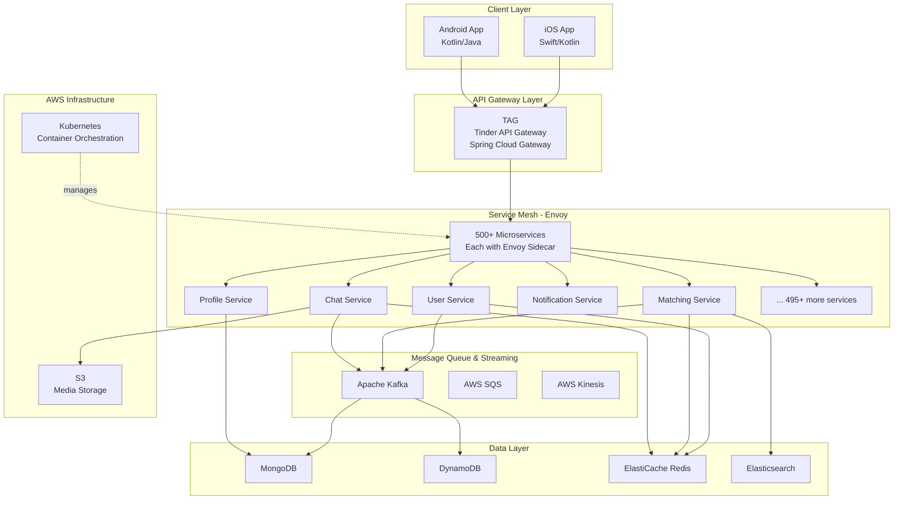
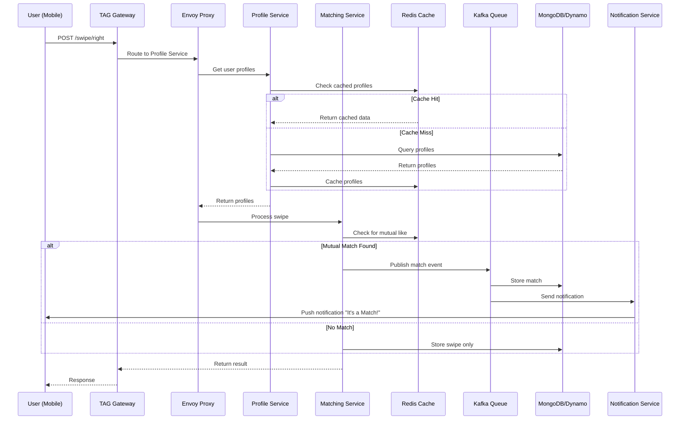
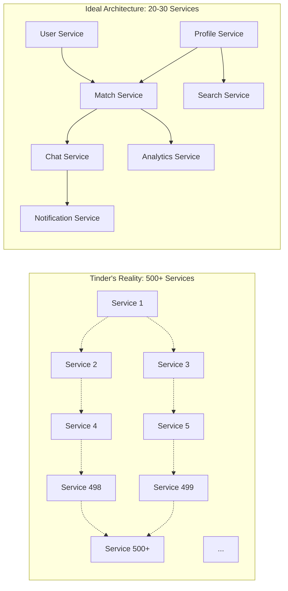
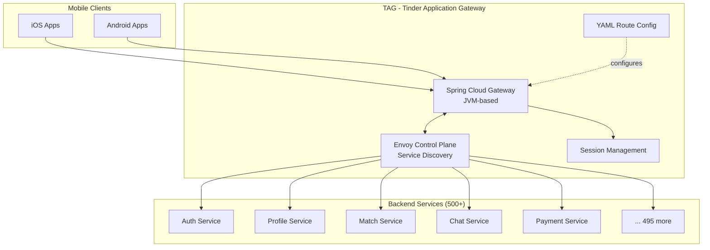

# Tinder - Technical Architecture & Stack Analysis

## Overview
Tinder is one of the world's largest dating platforms, serving 2 billion daily member actions and hosting over 30 billion matches. The platform handles massive scale with over 500 microservices.

---

## High-Level Architecture Diagram

## Request Flow: Swipe to Match

---

## Technology Stack

### Mobile Applications
- **iOS**: Native development
  - **Language**: Swift (migrated from Objective-C)
  - **Tools**: Objective-C (legacy), Ruby/Cucumber, RubyMotion
- **Android**: Native development
  - **Language**: Kotlin (transitioning from Java)
  - **Language**: Java (legacy)
- **Note**: Despite many clones using React Native, Tinder was built natively on each platform

### Backend Languages & Frameworks
- **Primary**: Node.js, JavaScript
- **Secondary**: Java, Scala
- **API Framework**: Spring Cloud Gateway (for TAG)
- **Web Server**: Express

### Database & Caching
- **Primary Database**: MongoDB, DynamoDB (sources vary, suggesting migration or multi-database usage)
- **In-Memory Cache**: Redis (ElastiCache on AWS)
  - Handles low-latency requirements for 2 billion daily actions
  - Critical for matching logic

### Cloud Infrastructure
- **Cloud Provider**: AWS (100% hosted)
- **Container Orchestration**: Kubernetes, Docker
- **Mobile Testing**: AWS Amplify
- **Services Used**:
  - Amazon ElastiCache (Redis)
  - DynamoDB
  - SQS (message queuing)
  - Kinesis (stream processing)
  - Various other AWS services

### Microservices Architecture
- **Service Count**: 500+ microservices
- **Service Mesh**: Envoy
  - Envoy proxy runs alongside each microservice
  - All inbound/outbound communication goes through Envoy
- **API Gateway**: TAG (Tinder Application Gateway)
  - Built in-house on Spring Cloud Gateway (Java Spring framework)
  - Replaced multiple third-party solutions (AWS Gateway, Apigee, Kong)
  - Handles routing to 500+ backend services

### Message Queue & Streaming
- **Technologies**: Kafka, SQS, Kinesis, Spark
- **Use Cases**:
  - Event-driven architecture
  - Message queuing between microservices
  - Real-time data streaming

### Real-Time Communication
- **Protocol**: WebSocket
- **Purpose**: Real-time messaging between users
- **Backend**: Kafka integration for message persistence and distribution

### Data & Search
- **Search Engine**: Elasticsearch
- **HTML5**: Frontend web components

### Build & Deployment
- **Scripting**: Bash
- **CI/CD**: Kubernetes-based deployments
- **Monitoring**: Custom solutions integrated with AWS

---

## Architecture Patterns

### Custom API Gateway (TAG)
- **Route As Configuration (RAC)**: Developers define API endpoints in YAML files
- **Service Discovery**: Integrates with Envoy control plane for backend service lookup
- **Centralized Management**: Unified session management across all APIs
- **Developer Velocity**: Faster shipping of modules to production

### Migration to ElastiCache
- Migrated from self-managed Redis to AWS ElastiCache
- Achieved immediate and dramatic gains in scalability and stability
- Supports massive scale requirements

## Microservices Complexity Visualization

## TAG API Gateway Architecture

---

## Technical Review & Assessment

### Strengths

#### 1. **Excellent Scalability Architecture**
- The 500+ microservices architecture allows for independent scaling of features
- Envoy service mesh provides excellent observability and traffic management
- Kubernetes orchestration handles massive traffic spikes effectively

#### 2. **Smart Infrastructure Choices**
- AWS ElastiCache migration was a wise decision, offloading Redis management complexity
- Full AWS commitment reduces multi-cloud complexity
- Using managed services (ElastiCache, DynamoDB) instead of self-hosting

#### 3. **Native Mobile Development**
- Building native iOS and Android apps provides the best possible performance and UX
- Swift and Kotlin are modern, performant languages
- Avoids the limitations and overhead of cross-platform frameworks

#### 4. **Custom API Gateway (TAG)**
- Solves real problems: inconsistent session management, incompatible tech stacks
- Built on proven Spring Cloud Gateway rather than completely from scratch
- RAC pattern enables developer autonomy while maintaining consistency

#### 5. **Event-Driven Architecture**
- Kafka integration with microservices is industry best practice
- Enables asynchronous communication and eventual consistency
- Better fault tolerance and system resilience

### Weaknesses & Limitations

#### 1. **Microservices Complexity**
- **500+ services is excessive** for most teams to manage
- High operational overhead: logging, monitoring, debugging, deployment coordination
- **Inter-service communication latency** can compound with deep call chains
- Distributed tracing and debugging become significantly more complex
- **Cost**: Running 500+ services with their own Envoy sidecars is resource-intensive

**Alternative**: A well-designed modular monolith or 20-50 services could achieve similar goals with far less complexity.

#### 2. **JVM-Based API Gateway**
- Spring Cloud Gateway runs on the JVM, which has higher memory overhead than alternatives
- **GC pauses** could impact latency for critical gateway operations
- Languages like Go or Rust would offer better performance/cost ratio for a gateway
- **Startup time**: JVM-based services have slower cold starts

#### 3. **Database Strategy Ambiguity**
- Sources mention both MongoDB and DynamoDB, suggesting either:
  - Migration in progress (technical debt)
  - Multi-database strategy (operational complexity)
- **MongoDB limitations**:
  - Not ideal for transactional workloads
  - Horizontal scaling can be complex
  - Query performance can degrade with poor schema design
- **DynamoDB limitations**:
  - Vendor lock-in to AWS
  - Limited querying capabilities compared to traditional databases
  - Cost can escalate with high read/write throughput

**Better Choice**: PostgreSQL with proper indexing, partitioning, and read replicas could handle Tinder's scale with better consistency guarantees.

#### 4. **Node.js for High-Scale Backend**
- Node.js is single-threaded, limiting CPU-bound operation performance
- Not ideal for computationally intensive tasks (though these can be offloaded)
- **Memory leaks** are more common in Node.js applications
- Better alternatives: Go, Java, or Rust for backend services requiring high throughput

#### 5. **Language Fragmentation**
- Using Node.js, Java, Scala across different services creates:
  - Need for polyglot teams
  - Different tooling, monitoring, and debugging approaches
  - Harder to share code libraries across services
  - Increased hiring complexity

**Better Approach**: Standardizing on 1-2 languages (e.g., Go + Kotlin) would improve maintainability.

#### 6. **Over-Engineering for Matching Logic**
- The swipe/match functionality is relatively simple algorithmically
- Could be handled by a smaller number of well-optimized services
- Current architecture likely has 10-20 services doing what 2-3 could handle

---

## What Could Be Better

### 1. **Consolidate Microservices**
- Reduce from 500+ to 30-50 well-bounded services
- Group related functionality into single services
- Use internal module boundaries instead of network boundaries

### 2. **Standardize Languages**
- Choose Go or Java for backend services (not both plus Node.js and Scala)
- Kotlin for Android, Swift for iOS
- TypeScript for any web frontend needs

### 3. **Database Strategy**
- Commit to one primary database:
  - **PostgreSQL** for transactional data, user profiles, matches
  - **Redis** for caching and real-time features
  - **S3** for media storage
- Use read replicas and connection pooling instead of NoSQL band-aids

### 4. **API Gateway Alternatives**
- Consider **Envoy Gateway** directly (since they already use Envoy service mesh)
- Or use **Kong** or **NGINX** for better performance than JVM-based solutions
- Or build a lightweight gateway in Go

### 5. **Simpler Event Architecture**
- Using both Kafka, SQS, and Kinesis is redundant
- Standardize on Kafka for event streaming
- Use simpler pub/sub for non-critical events

### 6. **Cost Optimization**
- With better service consolidation, could reduce cloud costs by 40-60%
- Fewer Envoy sidecars, fewer service instances, less inter-service network traffic
- Move some services to serverless (Lambda) for variable traffic patterns

---

## Conclusion

Tinder's architecture represents a **technically sophisticated but over-engineered** system. The move to microservices, cloud-native infrastructure, and custom tooling (TAG) shows strong engineering capability, but the execution has led to unnecessary complexity.

**Grade: B+**

**Strengths**: Native mobile apps, strong use of AWS managed services, solid event-driven architecture, good observability (Envoy).

**Critical Issues**: 500+ microservices is excessive, fragmented language choices, unclear database strategy, JVM overhead for critical path (gateway).

The architecture would benefit from **consolidation and simplification** without sacrificing scalability. Teams often confuse "scale" with "complexity" - you can handle billions of requests without 500 microservices.

**Key Takeaway**: Tinder's stack proves you can scale to massive heights with this architecture, but it doesn't prove this is the optimal way to do it. A team of talented engineers could build a simpler, more maintainable system that performs just as well at a fraction of the operational cost.
