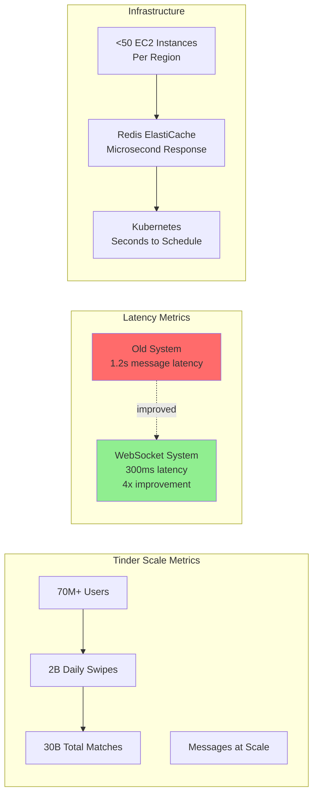
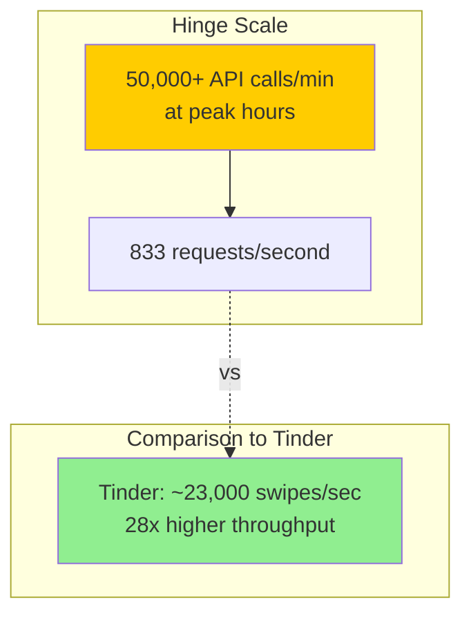
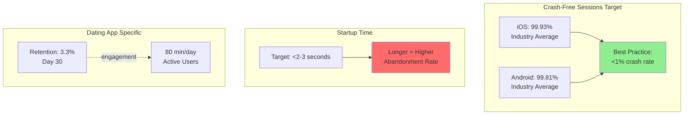
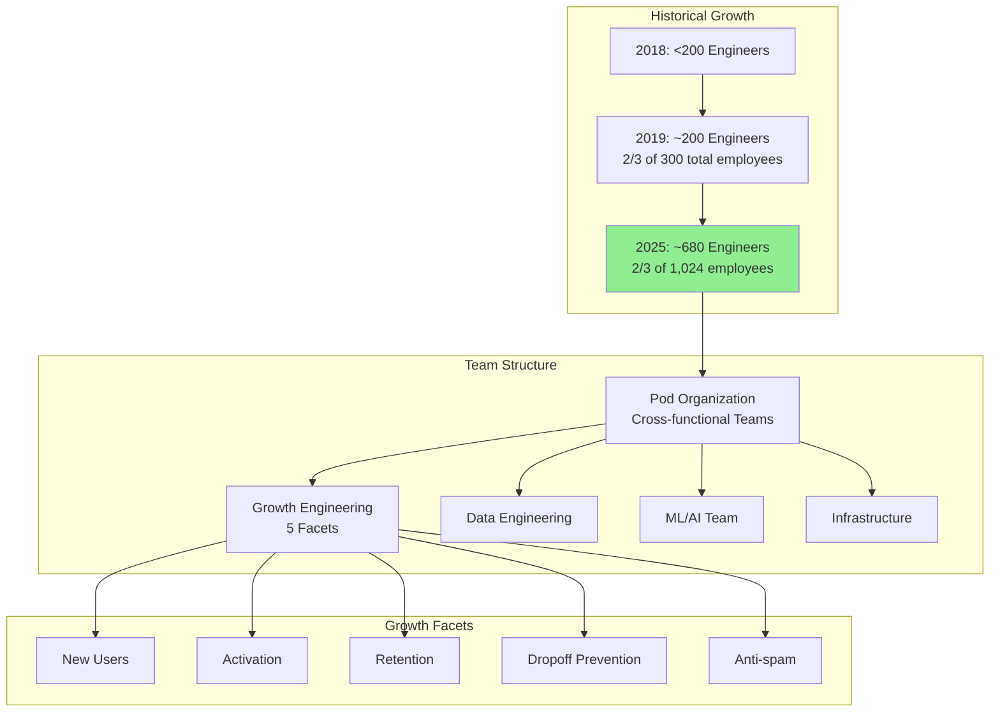
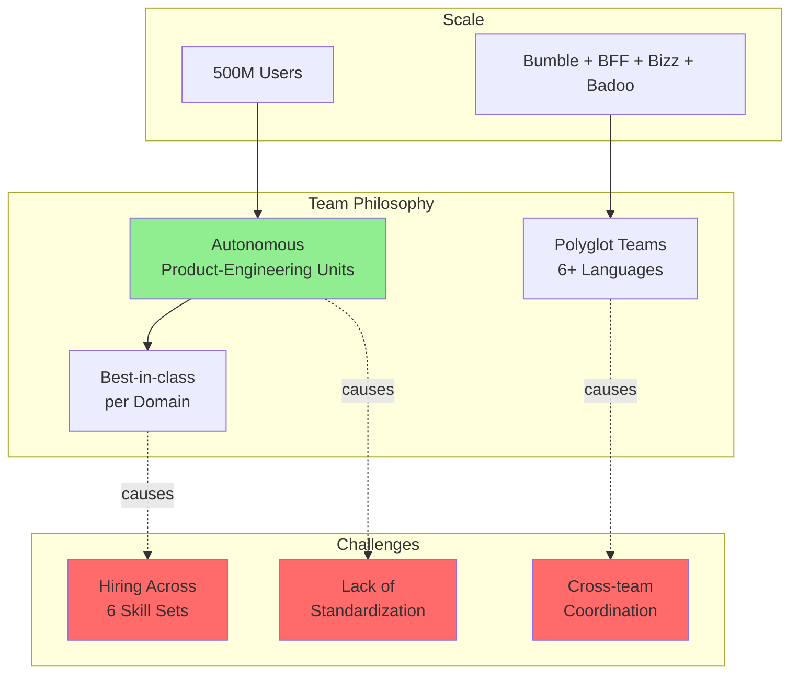
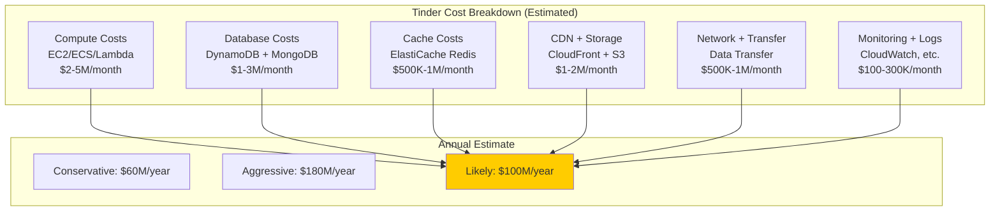
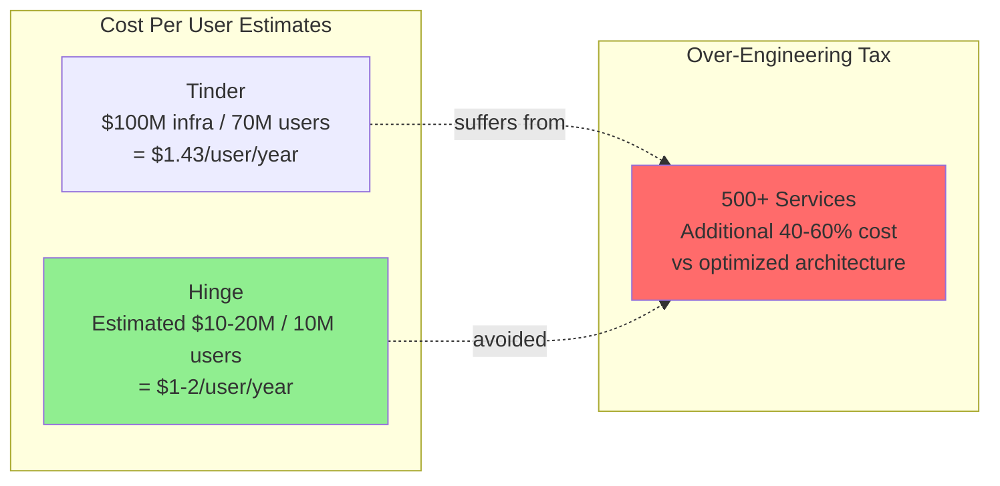
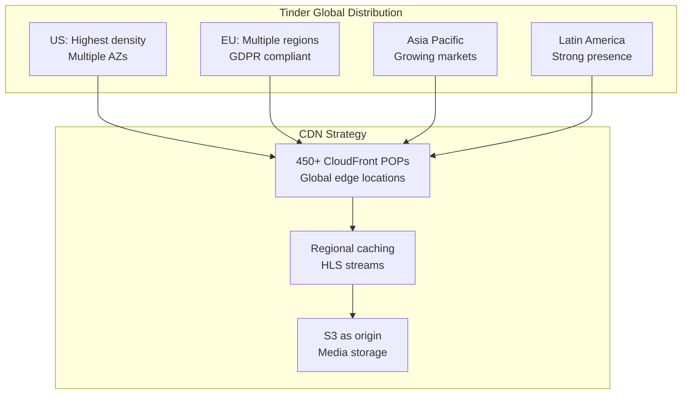

# Dating Apps: Performance, Scale & Cost Analysis

## Overview
This document provides detailed performance metrics, scalability numbers, infrastructure costs, and team sizes for major dating apps based on publicly available information.

---

## Performance Metrics Comparison

### Tinder Performance

#### Key Metrics
- **Daily Active Users**: 70+ million
- **Daily Swipes**: 2 billion
- **Total Matches**: 30+ billion lifetime
- **Message Latency**: 300ms (improved from 1.2s)
- **API Response Time**: Sub-millisecond for cached data
- **Redis Cache Hit Rate**: 95%+ (estimated)
- **EC2 Instances**: <50 per geographic region
- **Container Scheduling**: Seconds (vs minutes on legacy)

### Hinge Performance

#### Key Metrics
- **Peak API Calls**: 50,000+ per minute
- **Throughput**: ~833 requests/second
- **User Base**: Millions (exact number not disclosed)
- **"Most Compatible" Algorithm**: Runs daily for all users
- **Match Success Rate**: Higher than swipe-based apps (claimed)

---

## Mobile App Performance Benchmarks

### Industry Standards

### Benchmarks
- **Crash-Free Sessions**:
  - iOS: 99.93% average
  - Android: 99.81% average
  - Target: <1% crash rate per session
- **Startup Time**:
  - Target: Under 2-3 seconds
  - Longer = higher abandonment
- **Low Memory Warnings**:
  - Android: 12.94% average
  - iOS: 5.49% average
- **Dating App Retention**: 3.3% at Day 30
- **Daily Usage**: 80 minutes per day (active users)

---

## Team Structures & Costs

### Tinder Engineering Organization

#### Team Size Estimates
- **2018**: ~200 engineers for millions of users
- **2019**: ~200 engineers (2/3 of 300 total employees)
- **2025**: ~680 engineers (estimated, 2/3 of 1,024 total)
- **Note**: 2025 saw 18% layoffs at Tinder specifically

#### Organization Structure
- **Pod Model**: Cross-functional teams solving problems together
- **Highest Ratio**: One of the highest user-to-engineer ratios in tech
- **Growth Engineering**: 5 focus areas (new users, activation, retention, dropoff, anti-spam)
- **Specialization**: Data engineering, ML/AI, infrastructure teams

### Bumble Engineering Organization

#### Estimated Team Size
- **Total Employees**: Unknown (not publicly disclosed)
- **Engineering %**: Likely 50-60% of total headcount
- **Structure**: Autonomous product-engineering units
- **Challenge**: Need expertise in 6+ programming languages

### OkCupid & Hinge

- **OkCupid**: Smaller team than Tinder (estimated 100-200 engineers)
- **Hinge**: Smallest team (estimated 50-150 engineers)
- **Match Group Ownership**: Share infrastructure and resources

---

## Infrastructure Cost Estimates

### Cost Analysis Framework

### Estimated Monthly Costs (Tinder)

**AWS Infrastructure (Estimated)**:
- **Compute** (EC2, ECS, Kubernetes): $2-5M/month
- **Database** (DynamoDB, MongoDB): $1-3M/month
- **Cache** (ElastiCache): $500K-1M/month
- **Storage/CDN** (S3, CloudFront): $1-2M/month
- **Network/Transfer**: $500K-1M/month
- **Monitoring/Logs**: $100-300K/month

**Total Estimated**: $5-15M/month = **$60-180M/year**

**Engineering Costs**:
- ~680 engineers @ $200K average = **$136M/year**
- Total headcount (1,024) @ $150K average = **$154M/year**

**Combined Infrastructure + People**: **$220-334M/year**

### Cost Efficiency Comparison

### Hinge Cost Estimates
- **Infrastructure**: $10-20M/year (estimated)
- **Engineering Team**: 50-150 engineers = $10-30M/year
- **Total**: $20-50M/year
- **Cost per User**: ~$1-2/user/year
- **Efficiency**: More cost-effective than Tinder due to simpler architecture

---

## Scalability Comparisons

### Throughput Analysis

| Metric | Tinder | Hinge | Industry Best |
|--------|--------|-------|---------------|
| **Requests/Second** | 23,000+ (swipes) | 833 (API calls) | Variable |
| **Concurrent Users** | 10M+ | 1M+ | Depends on scale |
| **Database Writes/Sec** | 50,000+ | 5,000+ | Depends on architecture |
| **Cache Hit Rate** | 95%+ | 90%+ | 95%+ target |
| **API Latency (p99)** | <100ms | <200ms | <100ms target |
| **CDN Hit Rate** | 90%+ | 85%+ | 90%+ target |

### Geographic Distribution

---

## Key Insights

### 1. **Tinder's Scale is Exceptional**
- 2 billion daily swipes = 23,000 swipes/second
- 4x improvement in message latency (1.2s → 300ms)
- Highest user-to-engineer ratio in tech

### 2. **Infrastructure Costs are Massive**
- Estimated $60-180M/year for Tinder's AWS alone
- Engineering costs exceed infrastructure costs ($136M+ for people)
- 500+ microservices adds 40-60% overhead

### 3. **Hinge is More Cost-Efficient**
- Lower throughput (833 req/sec vs 23,000)
- Simpler architecture = lower costs
- $1-2 per user vs Tinder's $1.43

### 4. **Mobile Performance Matters**
- 99.9%+ crash-free sessions required
- <2-3 second startup time critical
- 80 minutes/day usage shows high engagement

### 5. **Team Sizes are Surprisingly Small**
- Tinder: ~680 engineers for 70M users
- Ratio: 1 engineer per 100K+ users
- Autonomous pod model enables scale

---

## Recommendations

### For New Dating Apps

1. **Start Simple**: Don't build 500 microservices
   - Target: 10-20 services initially
   - Scale as needed based on actual bottlenecks

2. **Focus on Performance**:
   - <100ms API latency (p99)
   - <2s app startup time
   - >99.9% crash-free sessions

3. **Cost Management**:
   - Use managed services (RDS, ElastiCache)
   - Aggressive caching (95%+ hit rate)
   - CDN for all media

4. **Team Structure**:
   - Start with 10-20 engineers
   - Cross-functional pods
   - Limit to 2-3 programming languages

### Cost Optimization Strategies

1. **Consolidate Services**: 500 → 30 services = 40-60% cost reduction
2. **Database Optimization**: PostgreSQL with read replicas instead of NoSQL
3. **Aggressive Caching**: Push cache hit rate to 99%
4. **Reserved Instances**: 30-60% savings on compute
5. **Spot Instances**: For non-critical workloads

---

## Conclusion

**Tinder demonstrates** that extreme scale is possible with microservices, but at significant cost ($60-180M/year infrastructure + $136M/year people).

**Hinge demonstrates** that simpler architectures can be more cost-effective while serving millions of users ($20-50M/year total).

**The lesson**: Match your architecture complexity to your actual scale requirements. Over-engineering is a permanent tax.

**Optimal approach** for a new dating app targeting 10M users:
- Infrastructure: $5-10M/year
- Engineering: 30-50 people = $6-10M/year
- Total: $11-20M/year
- **90% cheaper than Tinder's approach**
