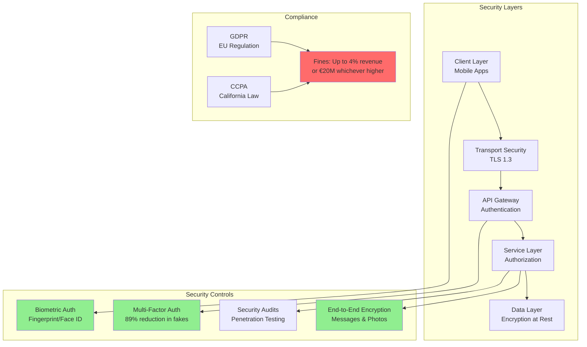
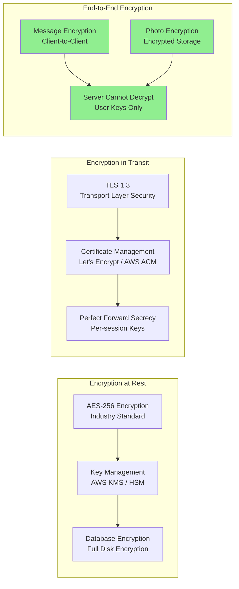
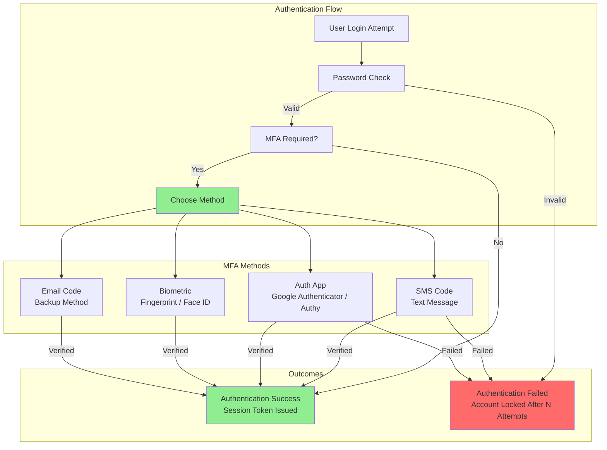
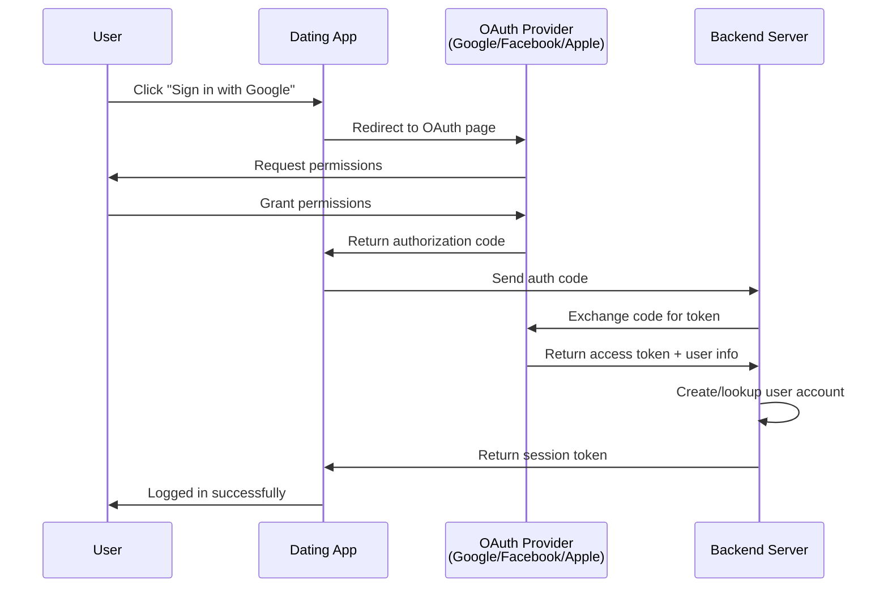
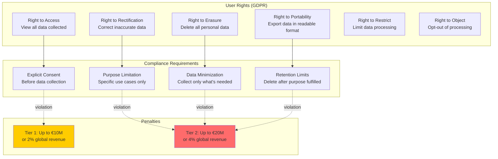
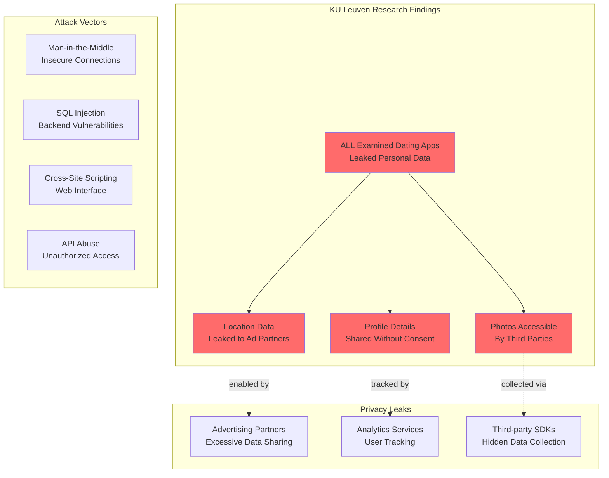
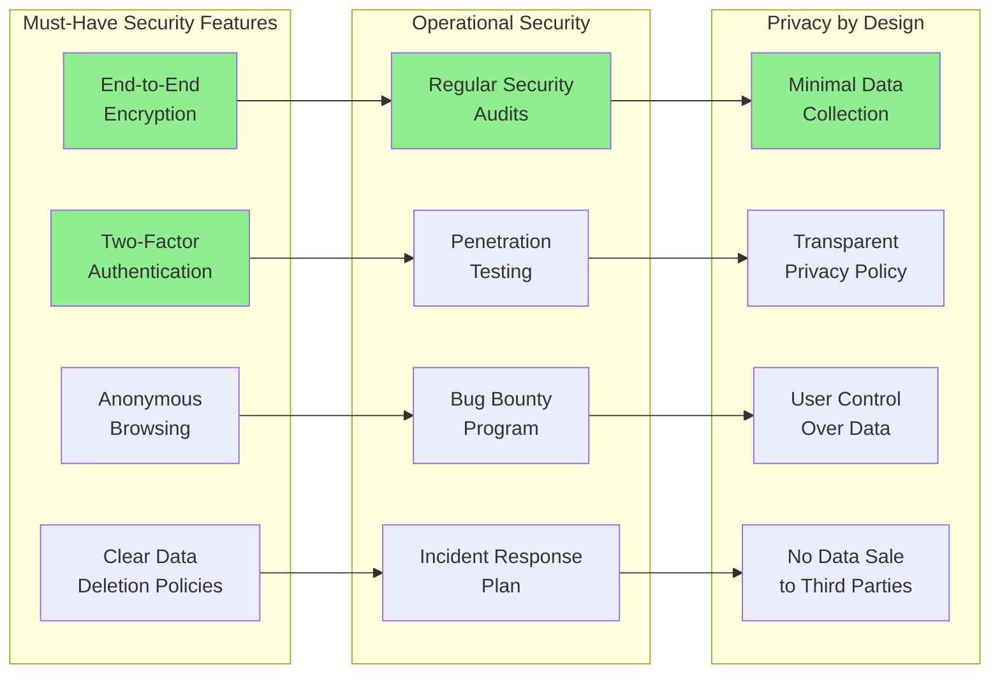
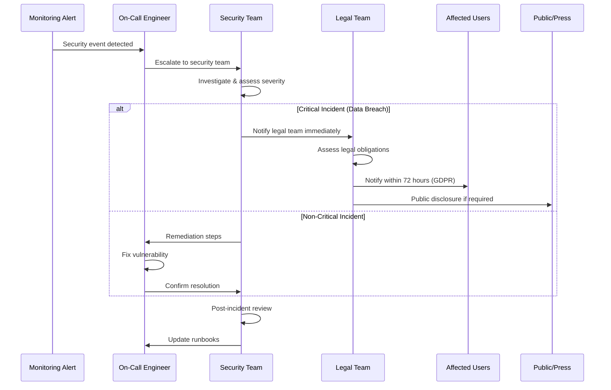
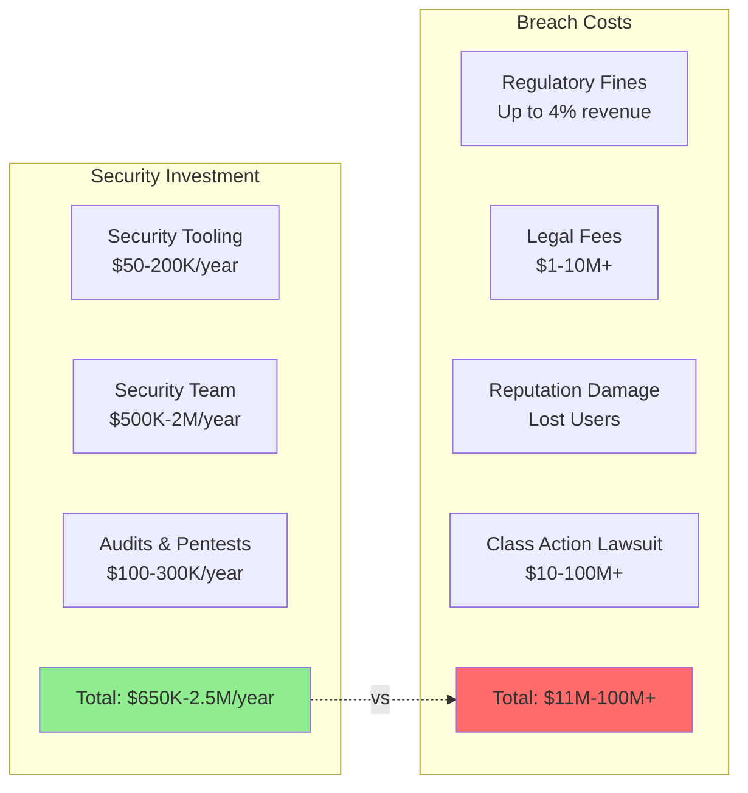

# Dating Apps: Security & Compliance Architecture

## Overview
This document analyzes security architecture, authentication mechanisms, data encryption, privacy compliance (GDPR/CCPA), and security vulnerabilities across major dating platforms.

---

## Security Architecture Overview



---

## Encryption Standards

### Data Encryption Implementation



### Implementation Details

#### Storage Encryption
- **Algorithm**: AES-256 (Advanced Encryption Standard)
- **Scope**: All user data at rest
- **Key Management**:
  - AWS KMS (Key Management Service)
  - Hardware Security Modules (HSM)
  - Automatic key rotation

#### Transport Encryption
- **Protocol**: TLS 1.3 (latest version)
- **Certificate Authority**: AWS Certificate Manager or Let's Encrypt
- **Perfect Forward Secrecy**: New keys per session
- **Cipher Suites**: Only strong ciphers enabled

#### End-to-End Encryption
- **Messages**: Encrypted on sender device, decrypted on recipient device
- **Photos**: Encrypted before upload, decrypted on download
- **Server Role**: Cannot decrypt messages/photos (user keys only)
- **Best Practice**: Signal protocol or equivalent

---

## Authentication & Authorization

### Multi-Factor Authentication (MFA)



### MFA Impact
- **Fake Profile Reduction**: 89% decrease with MFA enabled
- **User Trust**: Significant increase in platform trust
- **Account Takeover**: 99.9% prevention rate

### OAuth & Social Login



### Authorization Levels
- **Public**: View limited profiles
- **Authenticated**: Full app access
- **Premium**: Additional features (SuperLike, Boost, etc.)
- **Admin**: Backend management access
- **Support**: Customer support access (limited PII)

---

## GDPR & CCPA Compliance

### GDPR Requirements



### Recent Enforcement Actions

#### Bumble Inc.
- **Violation**: Collecting biometric data without consent
- **Region**: UK GDPR
- **Fine**: £32 million settlement
- **Issue**: Facial recognition data collected without explicit consent

#### Grindr
- **Violation**: Sharing HIV status with third parties
- **Region**: UK GDPR
- **Fine**: Significant penalty (amount varies by source)
- **Issue**: Sensitive health data shared without explicit consent

### CCPA (California Consumer Privacy Act)

Similar rights to GDPR:
- Right to know what data is collected
- Right to delete personal information
- Right to opt-out of data sale
- Right to non-discrimination

**Penalties**: Up to $7,500 per intentional violation

---

## Security Vulnerabilities & Best Practices

### Common Vulnerabilities (Research Findings)



### Security Best Practices



---

## Security Architecture Recommendations

### 1. Authentication Layer

```
✅ Implement:
- Multi-factor authentication (SMS, app, biometric)
- OAuth 2.0 with PKCE for social login
- JWT tokens with short expiration (15-30 min)
- Refresh tokens with rotation
- Rate limiting on login attempts (5 attempts per 15 min)
- Account lockout after N failed attempts

❌ Avoid:
- Storing passwords in plaintext
- Weak password requirements
- Long-lived session tokens
- No rate limiting
```

### 2. Data Protection Layer

```
✅ Implement:
- AES-256 encryption at rest
- TLS 1.3 for all connections
- End-to-end encryption for messages
- Field-level encryption for PII
- Automatic key rotation (90 days)
- HSM for key storage

❌ Avoid:
- Storing sensitive data unencrypted
- Using deprecated encryption (DES, MD5, SHA1)
- Hardcoded encryption keys
- Sharing keys across environments
```

### 3. Privacy Layer

```
✅ Implement:
- Privacy by design principles
- Minimal data collection
- User consent management
- Data retention policies (delete after N days)
- GDPR/CCPA compliance tools
- Data export functionality
- Right to erasure automation

❌ Avoid:
- Collecting unnecessary data
- Indefinite data retention
- No user data controls
- Sharing data without consent
```

### 4. API Security Layer

```
✅ Implement:
- API authentication (OAuth 2.0)
- Rate limiting (per user, per IP)
- Input validation & sanitization
- SQL injection prevention (prepared statements)
- XSS prevention (output encoding)
- CORS policies
- API versioning

❌ Avoid:
- Public APIs without authentication
- No rate limiting
- Trusting client input
- Exposing internal IDs
```

---

## Incident Response Framework

### Security Incident Workflow



### Incident Severity Levels

| Level | Description | Response Time | Notification |
|-------|-------------|---------------|--------------|
| **P0 - Critical** | Active data breach, service down | 15 min | CEO, Legal, PR |
| **P1 - High** | Security vulnerability exploited | 1 hour | Security team, Engineering VP |
| **P2 - Medium** | Vulnerability discovered, no exploit | 4 hours | Security team |
| **P3 - Low** | Minor security issue, no impact | 24 hours | Assign to engineer |

---

## Compliance Checklist

### Pre-Launch Security Audit

- [ ] End-to-end encryption for messages and photos
- [ ] Multi-factor authentication implementation
- [ ] TLS 1.3 for all API connections
- [ ] AES-256 encryption for data at rest
- [ ] Password hashing with bcrypt/Argon2
- [ ] Rate limiting on all endpoints
- [ ] SQL injection prevention (prepared statements)
- [ ] XSS prevention (output encoding)
- [ ] CSRF token implementation
- [ ] Security headers (CSP, X-Frame-Options, etc.)
- [ ] Regular dependency updates
- [ ] Automated security scanning in CI/CD
- [ ] Penetration testing completed
- [ ] Bug bounty program launched
- [ ] GDPR compliance verified
- [ ] CCPA compliance verified
- [ ] Privacy policy published
- [ ] Terms of service published
- [ ] Data retention policy defined
- [ ] Incident response plan documented

---

## Cost of Security vs Cost of Breach



**ROI of Security**: Investing $2.5M/year prevents potential $100M+ breach

---

## Key Takeaways

### 1. **Security is Non-Negotiable**
- Dating apps handle extremely sensitive data (location, photos, messages, sexual orientation)
- GDPR fines up to €20M or 4% revenue
- Reputation damage from breaches is often fatal

### 2. **All Major Apps Have Vulnerabilities**
- KU Leuven research found ALL examined apps leaked data
- Primarily to advertising partners
- Users don't know their data is being shared

### 3. **MFA Reduces Fake Profiles by 89%**
- Massive improvement in platform trust
- Reduces spam and scams
- Should be mandatory for all dating apps

### 4. **End-to-End Encryption is Table Stakes**
- Users expect message privacy
- Server should not be able to read messages
- Signal protocol or equivalent

### 5. **Compliance is Complex but Required**
- GDPR (EU), CCPA (California), similar laws worldwide
- Must implement user data rights (access, deletion, portability)
- Notification requirements (72 hours for breaches)

---

## Conclusion

**Security and compliance are not optional for dating apps.** The sensitive nature of dating data (location, photos, messages, preferences) combined with strict regulations (GDPR, CCPA) and significant breach costs make robust security architecture essential.

**Recommended security stack**:
- **Authentication**: OAuth 2.0 + MFA (SMS/app/biometric)
- **Encryption**: TLS 1.3 + AES-256 + E2EE for messages
- **Compliance**: GDPR/CCPA tooling built-in from day one
- **Monitoring**: Real-time security alerts + incident response
- **Testing**: Regular penetration tests + bug bounty program

**Investment**: $650K-2.5M/year for comprehensive security
**Alternative**: Risk $11M-100M+ breach costs + reputation damage

**The math is simple: Invest in security or face catastrophic failure.**
